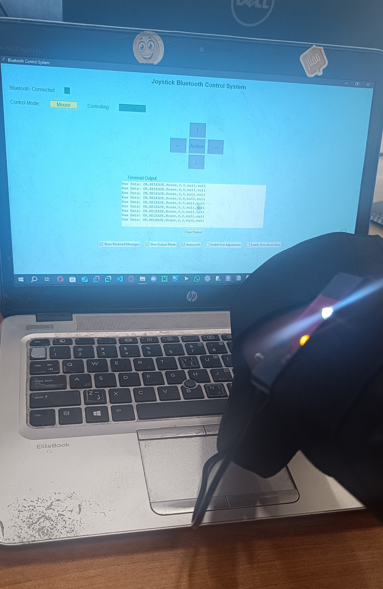
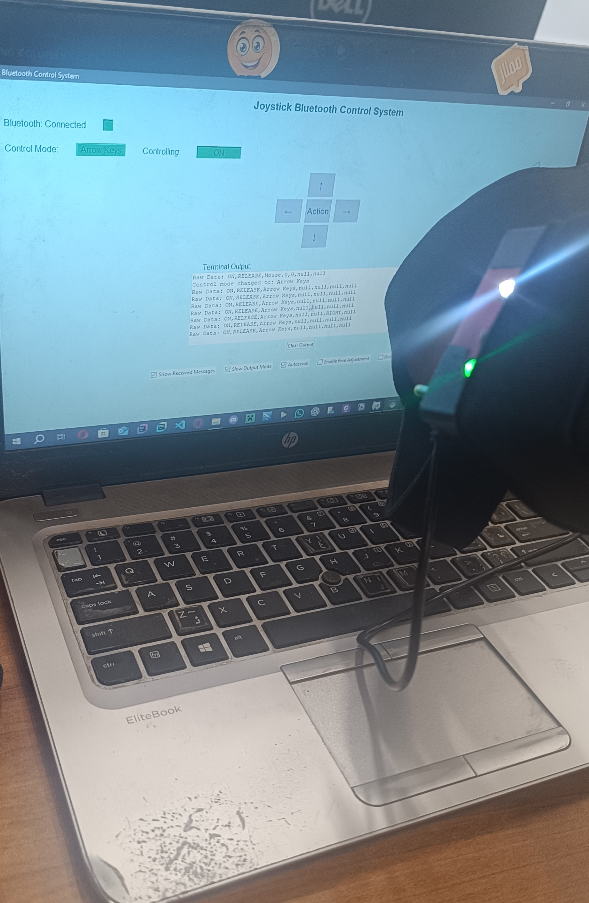
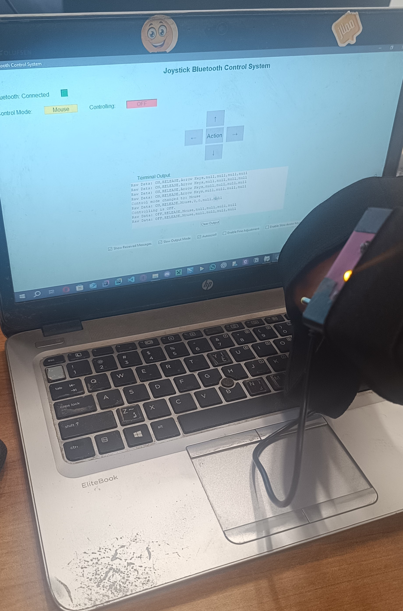

# Bluetooth Joystick Control System

This project implements a Bluetooth-based joystick control system that allows you to control mouse movements or arrow keys on your computer using an **Arduino Leonardo** and a Bluetooth module (HC-05). The system supports two modes: **Mouse Mode** and **Arrow Keys Mode**, with features like Fine Adjustment, slow arrow key mode, and customizable sensitivity.

---

## Table of Contents

1. [Overview](#overview)
2. [Features](#features)
3. [Requirements](#requirements)
4. [Setup Instructions](#setup-instructions)
5. [Version History](#version-history)
6. [Notes](#notes)
7. [Media](#media)
8. [Contributors](#contributors)
9. [Contributing](#contributing)
10. [License](#license)

---

## Overview

The Bluetooth Joystick Control System consists of two main components:
- **Arduino Code**: Handles input from the joystick and sends data to the Bluetooth module.
- **Python GUI Application**: Receives data from the Bluetooth module and controls the mouse/keyboard accordingly.

This system is designed specifically for the **Arduino Leonardo**, which has built-in support for emulating a mouse and keyboard.

---

## Features

- **Dual Modes**: Switch between Mouse Mode and Arrow Keys Mode.
- **Fine Adjustment**: Gradually increase mouse sensitivity over time for precise control.
- **Slow Arrow Key Mode**: Prevent rapid arrow key presses for smoother navigation.
- **Customizable Sensitivity**: Adjust the sensitivity of mouse movements.
- **Real-Time Feedback**: LED indicators and terminal output provide real-time status updates.
- **Disconnect Detection**: Automatically reconnects if the Bluetooth connection is lost.

---

## Requirements

### Hardware
- Arduino Leonardo
- HC-05 Bluetooth Module
- Joystick Module
- Push Buttons (for mode switching and mouse clicks)
- LEDs (optional, for visual feedback)

### Software
- Arduino IDE (for uploading the Arduino code)
- Python 3.x
- Required Python Libraries:
  - `serial`
  - `tkinter`
  - `pynput`
  - `threading`

Install the Python libraries using:
```bash
pip install pyserial pynput
```
 
---

## Setup Instructions

### Step 1: Upload Arduino Code
1. Open the provided Arduino sketch in the Arduino IDE.
2. Select the correct board (`Arduino Leonardo`) and port.
3. Upload the sketch to your Arduino.

### Step 2: Configure Bluetooth Module
1. Pair the HC-05 Bluetooth module with your computer.
2. Note the COM port assigned to the HC-05 module.

### Step 3: Run the Python Application
1. Update the `bluetooth_port` variable in the Python script with the correct COM port.
2. Run the Python script:
   ```bash
   python bluetooth_control.py
   ```

---

## Version History

### V1.0-49-7 (First Working Version)
* **Overview**: This is the first fully functional version of the Bluetooth Joystick Control System. It incorporates most of the initial design ideas and features, including Mouse Mode, Arrow Keys Mode, Fine Adjustment, and Slow Arrow Key Mode.
* **Features Implemented**:
  * Dual Modes: Switch between Mouse Mode and Arrow Keys Mode.
  * Fine Adjustment: Gradually increase mouse sensitivity over time for precise control.
  * Slow Arrow Key Mode: Prevent rapid arrow key presses for smoother navigation.
  * Customizable Sensitivity: Adjust the sensitivity of mouse movements.
  * Disconnect Detection: Automatically reconnects if the Bluetooth connection is lost.
* **Improvements Over Previous Versions**:
  * Simplified hardware design by replacing the glove concept with a joystick-based system, reducing computational overhead and improving overall stability.
  * Improved stability and reliability of the Arduino Leonardo's performance.
  * Enhanced software logic to handle Bluetooth disconnects and reconnects seamlessly.
* **Note on Previous Versions (Hardware and Software)**: Earlier versions of the project were largely non-functional due to hardware limitations (e.g., Arduino overloads caused by the gyroscope) and design challenges (e.g., high cost of flex sensors). These issues were addressed in this version by simplifying the hardware and focusing on core functionality.
* **Known Bugs**:
  * The mode does not update while controlling is OFF. This behavior is due to the current implementation prioritizing resource efficiency when control is disabled. A fix is planned for the next version.
* **TO BE ADDED**: Update the data structure to include the following fields: **(These fields were not included in the initial implementation due to the late-stage design changes. Adding them would require additional buttons or inputs to be added into the hardware design)**
  * ARROW SLOW MODE (ON, OFF)
  * FINE ADJUSTMENT MODE (ON, OFF)

  #### Current Data Structure:
  ```
  CONTROLLING STATE (ON, OFF),
  MOUSE CLICK STATE (PRESS, RELEASE),
  CONTROL MODE,
  X MOVEMENT MOUSE,
  Y MOVEMENT MOUSE,
  X DIRECTION ARROW,
  Y DIRECTION ARROW
  ```

  #### Proposed Data Structure:
  ```
  CONTROLLING STATE (ON, OFF),
  MOUSE CLICK STATE (PRESS, RELEASE),
  CONTROL MODE,
  X MOVEMENT MOUSE,
  Y MOVEMENT MOUSE,
  X DIRECTION ARROW,
  Y DIRECTION ARROW,
  ARROW SLOW MODE (ON, OFF),
  FINE ADJUSTMENT MODE (ON, OFF)
  ```

---

## Notes

* **Arduino Compatibility**: This project is specifically designed for the **Arduino Leonardo** due to its ability to emulate a mouse and keyboard. Using other boards may require additional modifications.
* **AI Assistance**: This project was developed with the help of AI tools for code organization, optimization and documentation.
* **College Project**: This project was created as part of my coursework during the **1st semester** of my studies in **Communications and Electronics Engineering**. It may not be actively updated in the future.
* **Teamwork Project**: This was a collaborative effort. All team members worked together across hardware, software, testing, and documentation.
* **Initial Idea**: The initial concept was to create a glove equipped with a gyroscope and flex sensors for gesture-based control. However, due to the high cost of flex sensors, we transitioned to using a joystick for input.
* **Gyroscope Challenges**: During testing, the integration of the gyroscope caused frequent overloads on the Arduino Leonardo, rendering it unresponsive. Although a solution was implemented to auto-restart the device upon detecting inactivity, this led to frequent disruptions, making the system impractical for use.
* **Final Design**: As a result, the gyroscope was removed, and the project was simplified to a joystick-based system for controlling mouse movements and arrow keys. Due to time constraints and hardware limitations, features like **Fine Adjustment** and **arrow key slow mode** were not implemented as toggleable options via the Arduino. These features are currently controlled through the Python GUI application instead. This decision was made because adding more buttons to the hardware design would have required significant changes at a late stage of development.
* **Hardware Design**: The hardware design will be posted and linked on my **LinkedIn** profile for further reference. (Will post and link the hardware simple design later on my LinkedIn.)
* **Testing Methodology**: To ensure the system worked as intended, we tested it in three practical scenarios:
  * Playing **Brotato**, a game requiring precise keyboard inputs.
  * Simulating a **PowerPoint presentation**, where arrow keys and mouse clicks are essential.
  * Testing with a **worm game** we developed in another project during the same semester, which required both mouse movement and keyboard controls.
* **Future Enhancements**: Consider adding support for more advanced features, such as customizable keybindings or gesture recognition.

---

## Media

All project demonstrations and showcases are located in the `/media` folder.  
Each video thumbnail below is clickable and redirects to the corresponding **YouTube** showcase.

Click any item below to jump directly to its section:

- [Vid 1 – Usage Showcase](#vid-1--usage-showcase)  
- [Vid 2 – GUI Showcase and Normal Usage](#vid-2--gui-showcase-and-normal-usage)  
- [Vid 3 – Hardware Showcase and GUI Reaction](#vid-3--hardware-showcase-and-gui-reaction)  
- [Vid 4 – Presentation Showcase (Slow vs Normal Arrow Keys)](#vid-4--presentation-showcase-slow-vs-normal-arrow-keys)  
- [Vid 5 – GUI Showcase](#vid-5--gui-showcase)  
- [Vid 6 – GUI Focused Showcase (Less Joystick Usage)](#vid-6--gui-focused-showcase-less-joystick-usage)  
- [Pic 7 – Device ON, Mouse Mode](#pic-7--device-on-mouse-mode)  
- [Pic 8 – Device ON, Arrow Keys Mode](#pic-8--device-on-arrow-keys-mode)  
- [Pic 9 – Device OFF, Mouse Mode](#pic-9--device-off-mouse-mode)

---

### Vid 1 – Usage Showcase
[](https://youtube.com/shorts/CeDSKw75bns?feature=share)

---

### Vid 2 – GUI Showcase and Normal Usage
[](https://youtube.com/shorts/0Trd5TWSWrs?feature=share)

---

### Vid 3 – Hardware Showcase and GUI Reaction
[](https://youtube.com/shorts/mPm_qDDwzcw?feature=share)

---

### Vid 4 – Presentation Showcase (Slow vs Normal Arrow Keys)
[](https://youtu.be/yMeXWaSxd0M)

---

### Vid 5 – GUI Showcase
[](https://youtu.be/o86kStwZqwI)

---

### Vid 6 – GUI Focused Showcase (Less Joystick Usage)
[](https://youtu.be/yVnnJrcHNMg)

---

### Pic 7 – Device ON, Mouse Mode


---

### Pic 8 – Device ON, Arrow Keys Mode


---

### Pic 9 – Device OFF, Mouse Mode


---

## Contributors

* **[@A7mad-Alone](https://github.com/A7mad-Alone) — Ahmad Adham**
* **[@Ali7xyz](https://github.com/Ali7xyz) — Ali Abdelnasser**
* **[@Eslam-Mohammed198](https://github.com/Eslam-Mohammed198) — Eslam Mohammed**

All team members worked together collaboratively on all aspects of the project — hardware, software, testing, and documentation.

---

## Contributing

Contributions are welcome! If you'd like to contribute, please fork the repository and create a pull request with your changes. Ensure that your contributions align with the project's goals and coding standards.

---

## License

This project is licensed under the MIT License. See the [LICENSE](LICENSE) file for details.

---

Thank you for using the Bluetooth Joystick Control System! If you have any questions or suggestions, feel free to open an issue on this repository.